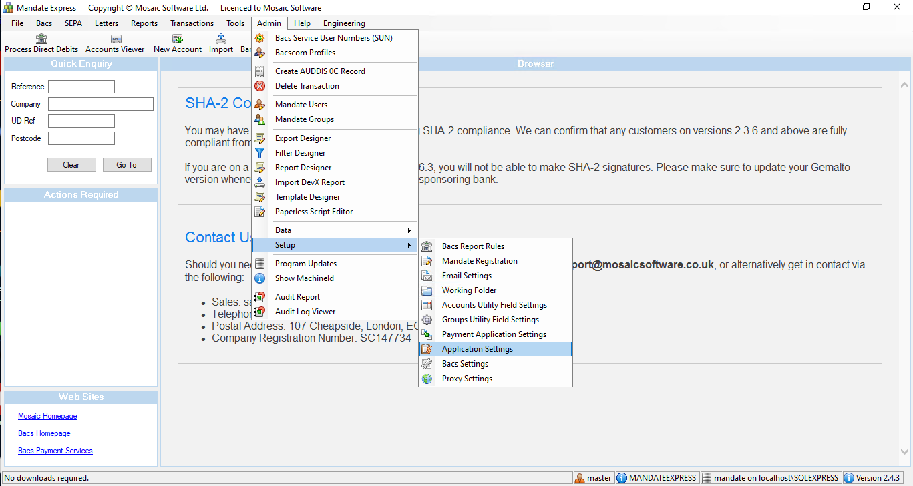
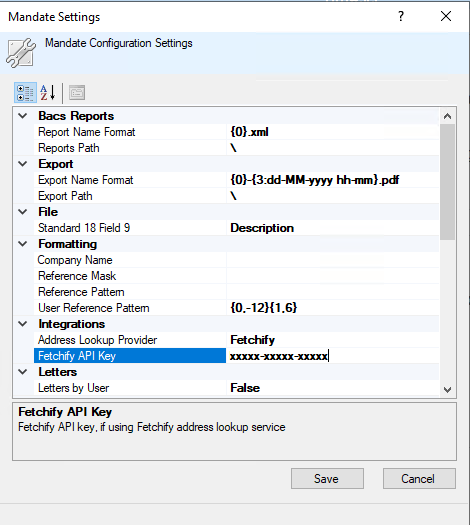
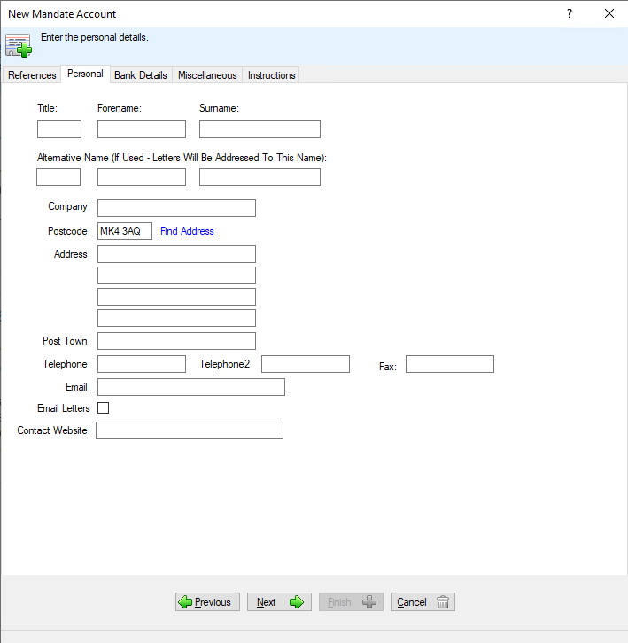

# Enabling Fetchify within Mosaic Managed

In order to enable Fetchify within Mosaic Managed, follow the below steps

### Open Application Settings

Within Mosaic Managed, navigate to `Admin > Setup > Application Settings`

### Enter Fetchify API Key

1. Under the *Integrations* section, change the `Address Lookup Provider` to `Fetchify`.
1. Enter the Fetchify API Key within the relevant field
1. Press Save

### Utilising the Integration

Within the Mandate Management, you should now see a `Find Address` link when entering a Postcode, which will lookup the addresses available.

