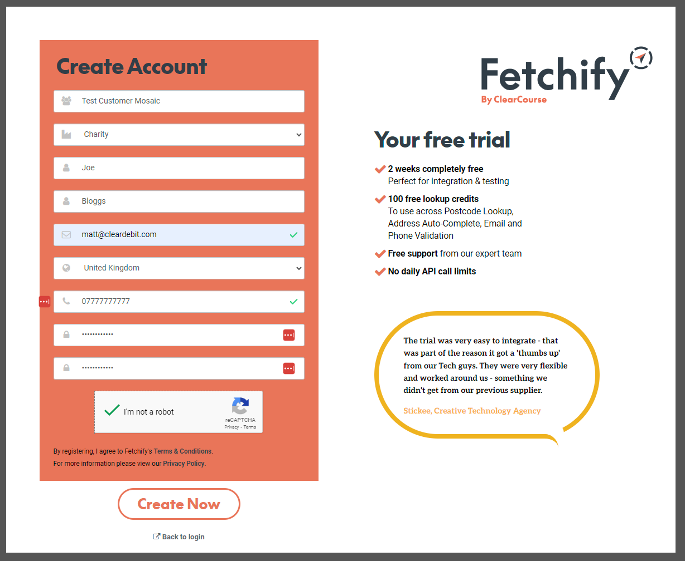
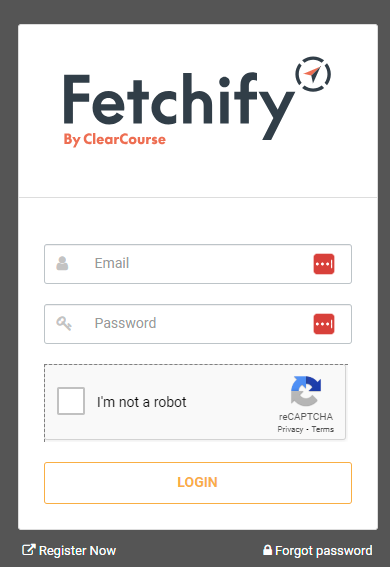
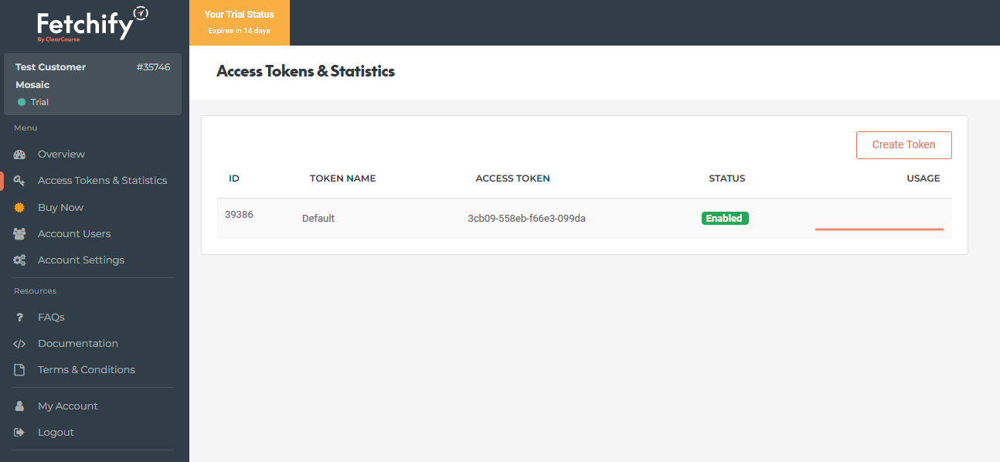
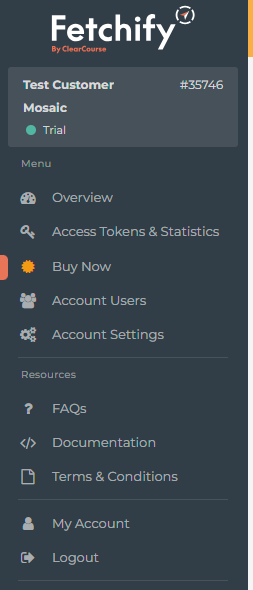

# Enabling Fetchify within Mosaic Managed

In order to enable Fetchify within Mosaic Managed, follow the below steps

### Register for a Fetchify Account

Navigate to the [Fetchify Account signup form here](http://account.fetchify.com#/signup?affiliate=Cleardebit), which will also provide you 100 free-trial credits to test out this new functionality.

Once you have registered, login using the details entered during signup:

Navigate to `Access Tokens & Statistics` and take note of the `Access Token` within this screen (this will be used in later steps).

### Ensure you are running the latest version of Mosaic Managed

You are required to be running the latest version of Mosaic Managed, at least `2.4.30` in order to support the new Fetchify Address Lookup service.

### Open Application Settings

Within Mosaic Managed, navigate to `Admin > Setup > Application Settings`

### Enter Fetchify API Key

1. Under the *Integrations* section, change the `Address Lookup Provider` to `Fetchify`.
1. Enter the Fetchify API Key within the relevant field
1. Press Save

### Utilising the Integration

Within the Mandate Management, you should now see a `Find Address` link when entering a Postcode, which will lookup the addresses available.

### Purchasing additional credits

The trial account of Fetchify comes pre-loaded with 100 free credits, which can be used for the first 14 days. When you see the value in the ability to lookup addresses
automatically within Mosaic Managed, log back into the Fetchify portal, and go to `Buy Now` to add a credit pack to your account.

